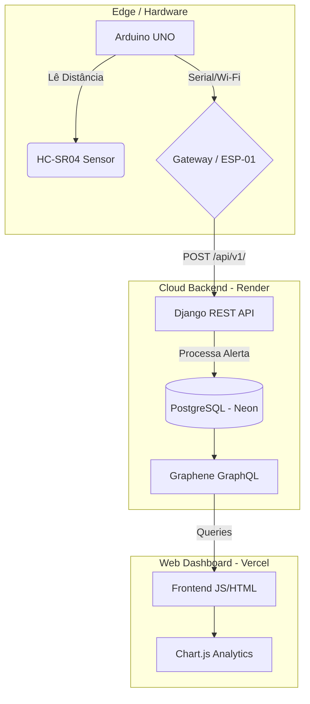

# Vibe Coluna — Wearable IoT Posture Monitor


> An end-to-end IoT solution designed to monitor posture in real-time using an edge sensor, a cloud-hosted backend, and an interactive web dashboard.

## Visão Geral (Overview)

O **Vibe Coluna** é um sistema completo de Internet das Coisas (IoT) focado em saúde e ergonomia. Utilizando um sensor ultrassônico na borda (edge) acoplado a um Arduino, o sistema capta a distância do usuário em relação à tela/mesa. Os dados são enviados em tempo real para uma API RESTful na nuvem, onde são processados, armazenados em um banco de dados relacional e expostos via GraphQL para um Dashboard web analítico.

## Arquitetura do Sistema

O projeto foi construído pensando em escalabilidade e separação de responsabilidades (Edge, Backend, Frontend):



## Destaques de Engenharia e Resiliência

Um dos maiores desafios em projetos de IoT é a estabilidade do hardware de rede na borda (Edge). Durante o desenvolvimento, o módulo Wi-Fi ESP-01S apresentou instabilidades de hardware (brownouts e falhas de memória flash).

**Solução de Resiliência (Fallback):**
Para garantir a integridade da coleta de dados e o funcionamento contínuo do sistema, foi desenvolvido um **Python Serial Gateway** (`arduino_integration/serial_gateway.py`). Esse script atua como um *Edge Node* confiável, interceptando a comunicação serial nativa do Arduino e realizando a ponte segura (HTTP POST) diretamente para a API na nuvem. Isso demonstra adaptabilidade arquitetural e tratamento de falhas em nível de hardware.

## Estrutura do Repositório

```text
Vibe_Coluna/
├── backend/                  # Django backend (API REST + GraphQL)
│   ├── posture/              # Core app (Models, Views, Schema)
│   └── requirements.txt      # Dependências Python
├── frontend/                 # Dashboard estático (HTML/JS/CSS)
│   └── index.html            # Interface de gráficos e KPIs em tempo real
├── arduino_integration/      # Códigos C++ e Python Gateway
│   ├── serial_gateway.py     # Script de fallback e resiliência de rede
│   └── ultrasonic_sensor/    # Firmware do Arduino (C++)
└── README.md
```

## API e Comunicação

O sistema suporta arquitetura híbrida de APIs:

### 1. Ingestão de Dados (REST)

O Arduino/Gateway envia dados brutos via `POST`.

- **Endpoint:** `POST /api/v1/sensors/<id>/reading/`
- **Payload:** `{"value": 45.2}`

### 2. Consumo de Dados (GraphQL)

O Dashboard consome os dados de forma otimizada, solicitando apenas os campos necessários para renderizar os gráficos.

```graphql
query {
  recentReadings(limit: 50) {
    distance
    isAlert
    timestamp
  }
}
```

## Tecnologias Utilizadas

- **Edge / Hardware:** Arduino UNO, HC-SR04 (Ultrassônico).
- **Backend:** Python 3.10+, Django 5.x, Graphene-Django (GraphQL).
- **Database:** PostgreSQL (Hospedado no Neon).
- **Frontend:** HTML5, Vanilla JavaScript, Chart.js, TailwindCSS.
- **Deploy / DevOps:** Render (Backend), Vercel (Frontend), Gunicorn.

## Como Executar Localmente

### 1. Backend (Django)

```bash
cd backend
python -m venv venv
source venv/bin/activate  # ou venv\Scripts\activate no Windows
pip install -r requirements.txt
python manage.py migrate
python manage.py runserver
```

### 2. Frontend (Dashboard)

```bash
cd frontend
python -m http.server 3000
# Acesse http://localhost:3000
```

### 3. Hardware (Gateway)

Com o Arduino conectado à porta USB:

```bash
cd arduino_integration
python serial_gateway.py --port /dev/ttyACM0 --baud 9600
```

---

*Desenvolvido por Diego Silva.*
